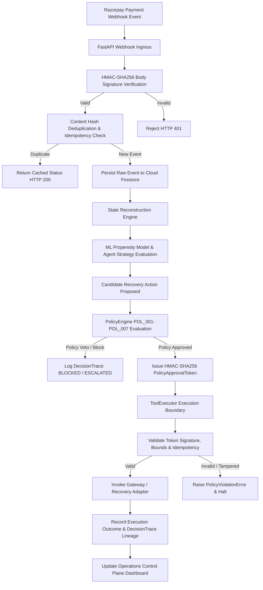
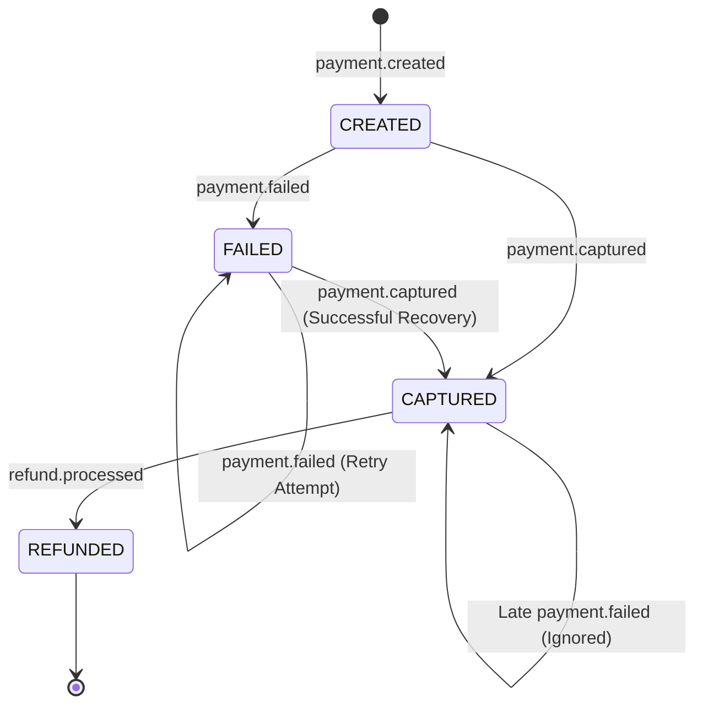
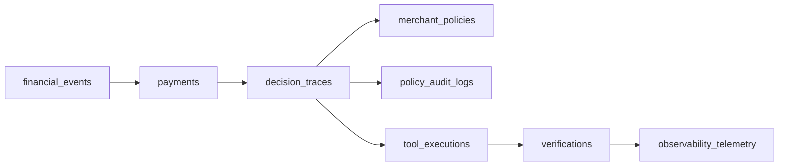
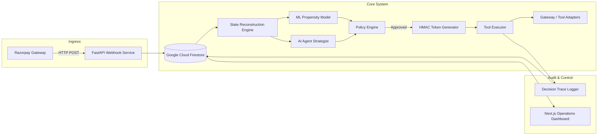

# RAVEN — Revenue-aware Autonomous Verification & ENgine

> An autonomous revenue-recovery and payment-verification engine that combines probabilistic intelligence with deterministic financial controls.


---

## Table of Contents
- [1. What RAVEN Does](#1-what-raven-does)
- [2. The Problem](#2-the-problem)
- [3. Core Design Principle](#3-core-design-principle)
- [4. End-to-End Flow](#4-end-to-end-flow)
- [5. Webhook Flow](#5-webhook-flow)
- [6. State Reconstruction](#6-state-reconstruction)
- [7. AI / ML Architecture](#7-ai--ml-architecture)
- [8. Policy Engine](#8-policy-engine)
- [9. Approval Token Security](#9-approval-token-security)
- [10. Tool Executor](#10-tool-executor)
- [11. Idempotency and Replay Protection](#11-idempotency-and-replay-protection)
- [12. Multi-Tenancy](#12-multi-tenancy)
- [13. Auditability / Decision Trace](#13-auditability--decision-trace)
- [14. Operations Dashboard](#14-operations-dashboard)
- [15. System Architecture](#15-system-architecture)
- [16. Technology Stack](#16-technology-stack)
- [17. Project Structure](#17-project-structure)
- [18. Local Setup](#18-local-setup)
- [19. Webhook Local Development](#19-webhook-local-development)
- [20. Testing](#20-testing)
- [21. Security Model](#21-security-model)
- [22. Failure Modes](#22-failure-modes)
- [23. Example Lifecycle](#23-example-lifecycle)
- [24. Policy Veto Example](#24-policy-veto-example)
- [25. Design Invariants](#25-design-invariants)
- [26. Configuration Reference](#26-configuration-reference)
- [27. Operational Notes](#27-operational-notes)
- [28. Limitations](#28-limitations)
- [29. Roadmap](#29-roadmap)
- [30. License](#30-license)

---

## 1. What RAVEN Does

RAVEN is an autonomous revenue-recovery and financial transaction verification platform built for payment gateways, merchants, and enterprise billing systems. It intercepts failed payment transactions, diagnoses root causes using predictive machine learning and AI strategies, and executes recovery operations under strict deterministic policy constraints.

A payment failure is not automatically a candidate for retry. RAVEN operates through eight disciplined stages:

1. **Ingests** real-time payment webhook events from Razorpay.
2. **Reconstructs** the immutable payment state history from raw event sequences.
3. **Evaluates** recovery propensity using machine learning classification models.
4. **Formulates** candidate recovery strategies via contextual AI reasoning.
5. **Applies** deterministic financial policy gates (`POL_001` through `POL_007`).
6. **Issues** cryptographically signed HMAC-SHA256 authorization tokens ONLY for policy-cleared actions.
7. **Executes** side-effect operations exclusively through a verified execution boundary (`ToolExecutor`).
8. **Records** comprehensive, tamper-evident audit traces in Google Cloud Firestore.

```
AI Recommends  ──►  Policy Decides  ──►  Authorization Permits  ──►  ToolExecutor Executes  ──►  Firestore Records
```

---

## 2. The Problem

Payment processing failures—caused by issuer bank downtimes, network drops, temporary card limits, or authentication timeouts—lead to significant revenue loss for online merchants. Traditional recovery solutions suffer from two major architectural flaws:

1. **Naive Automated Retries**: Blindly retrying failed transactions creates severe operational and financial risks:
   - **Duplicate Charges**: Retrying payments without state verification leads to double debits.
   - **Customer Spam**: Spamming customers with payment links causes opt-out violations and brand damage.
   - **Outage Flooding**: Retrying during active bank outages wastes API limits and depresses approval rates.
   - **Misattributed Recovery**: Claiming credit for organic customer retries rather than automated interventions.

2. **Unconstrained Autonomous Agents**: Giving Large Language Models (LLMs) direct access to execution APIs introduces non-deterministic behavior: hallucinated refund amounts, unauthorized retries on captured transactions, or bypassed compliance rules.

RAVEN resolves this by establishing a strict boundary between **probabilistic intelligence** (which suggests what *might* work) and **deterministic financial control** (which enforces what is *permitted* to happen).

---

## 3. Core Design Principle

RAVEN's architecture is rooted in the principle of **Zero-Trust Autonomous Execution**:

```text
┌─────────────────────────────────────────────────────────┐
│                    AI / ML LAYER                        │
│                 (Advisory Intelligence)                 │
│                                                         │
│  • ML Propensity Scoring      • Root Cause Diagnosis   │
│  • Contextual Bandits         • Strategy Formulations   │
└────────────────────────────┬────────────────────────────┘
                             │ Candidate Proposal
                             ▼
┌─────────────────────────────────────────────────────────┐
│                    POLICY ENGINE                        │
│                (Deterministic Authority)                │
│                                                         │
│  • POL_001 Terminal State     • POL_004 High Value Cap  │
│  • POL_002 Ambiguous State    • POL_005 Low Confidence  │
│  • POL_003 Max Retry Limit    • POL_006 Opt-Out / Spam  │
│                               • POL_007 Bank Outage     │
└────────────────────────────┬────────────────────────────┘
                             │ Approved Action Only
                             ▼
┌─────────────────────────────────────────────────────────┐
│                AUTHORIZATION ISSUANCE                   │
│             (Cryptographic HMAC Token)                  │
│                                                         │
│  Binds: (decision_id, payment_id, action_type, amount)  │
└────────────────────────────┬────────────────────────────┘
                             │ Valid Token Required
                             ▼
┌─────────────────────────────────────────────────────────┐
│                    TOOL EXECUTOR                        │
│            (Sole Side-Effect Execution)                 │
│                                                         │
│  • Smart Retry Tool        • Payment Link Dispatch      │
│  • Fallback Channel Notify • Escalate To Human          │
└────────────────────────────┬────────────────────────────┘
                             │ Authorized Gateway Call
                             ▼
                  Razorpay / Gateway Adapter
```

No AI or ML module possesses direct access to gateway APIs, credentials, or execution functions. Every side effect must be authorized by a signed `PolicyApprovalToken` issued by `PolicyEngine`.

---

## 4. End-to-End Flow



### Step-by-Step Flow Explanation

1. **Ingress**: Razorpay POSTs an event payload to `/api/v1/webhooks/razorpay`.
2. **Signature Verification**: `WebhookService` extracts raw HTTP body bytes and compares the computed HMAC-SHA256 signature against `X-Razorpay-Signature` using `hmac.compare_digest`.
3. **Idempotency Guard**: The event payload is hashed via SHA-256 (`content_hash`). If already ingested, RAVEN responds with `{ "duplicate": true }` without re-triggering processing.
4. **Persistence**: Raw payload is stored in the `financial_events` collection in Cloud Firestore.
5. **State Reconstruction**: `StateReconstructor` queries historical events for the payment ID, sorting by sequence to derive current payment status (`CREATED`, `FAILED`, `CAPTURED`, `REFUNDED`).
6. **Advisory Intelligence**:
   - `PropensityModel` computes ML recovery probability score ($P \in [0.0, 1.0]$).
   - Agent reasoning modules select a candidate recovery strategy (`SMART_RETRY`, `PAYMENT_LINK_DISPATCH`, `FALLBACK_CHANNEL_NOTIFY`, `ESCALATE_TO_HUMAN`).
7. **Policy Evaluation**: `PolicyEngine` evaluates the candidate strategy against active rules (`POL_001` to `POL_007`).
8. **Token Issuance**: If approved, `PolicyApprovalToken` is cryptographically generated, signing the exact parameters.
9. **Tool Execution**: `ToolExecutor` verifies token validity, checks idempotency keys, and dispatches the action to gateway adapters.
10. **Audit Logging**: Execution details are logged to `decision_traces` and `tool_executions` in Cloud Firestore for dashboard visibility.

---

## 5. Webhook Flow

```text
Razorpay Gateway
       │
       │ HTTP POST /api/v1/webhooks/razorpay
       ▼
Extract Request Headers (X-Razorpay-Signature, X-Razorpay-Event-Id)
       │
       │ Read Raw Bytes (bytes_body)
       ▼
Compute HMAC-SHA256 (key = RAZORPAY_WEBHOOK_SECRET)
       │
       ├───────────────────────────────┐
  Match? (compare_digest)             Mismatch?
       │                               │
       ▼                               ▼
Header Check: X-Razorpay-Event-Id   HTTP 401 Unauthorized
       │                             {"error": "INVALID_SIGNATURE"}
       ▼
Check Firestore Deduplication Index
       │
       ├───────────────────────────────┐
  Seen Hash / Event ID?              New Event
       │                               │
       ▼                               ▼
HTTP 200 OK                         Persist to financial_events
{"duplicate": true}                    │
                                       ▼
                                Trigger State Reconstruction
```

### Security Properties of Webhook Ingress
- **Raw-Body Preservation**: Signature check is performed directly on raw request bytes to prevent JSON re-serialization attacks.
- **Constant-Time Comparison**: `hmac.compare_digest` prevents timing attacks during signature validation.
- **Environment Secret Binding**: Webhook secret is resolved dynamically from `RAZORPAY_WEBHOOK_SECRET`.

---

## 6. State Reconstruction

RAVEN does not rely on single event snapshots. Webhooks may arrive out of order, experience network latency, or be re-delivered. The `StateReconstructor` builds a deterministic payment state by evaluating the full chronological event log.



### State Reconstruction Invariants

- **Terminal Lock**: Once a payment enters `CAPTURED` or `REFUNDED` status, it is locked into a terminal state.
- **Late Failure Rejection**: If a `payment.failed` event arrives after a `payment.captured` event, the reconstructed state remains `CAPTURED`.
- **Sequence Ordering**: Events are ordered by `created_at` timestamp and event sequence counters to resolve out-of-order delivery.

---

## 7. AI / ML Architecture

RAVEN incorporates machine learning and LLM reasoning exclusively as advisory components.

### Machine Learning Propensity Model (`ml/`)
- **Model**: Logistic Regression classification pipeline trained on historical transaction attributes.
- **Features**: Card brand, issuer bank code, payment method, minor unit amount, hour of day, day of week, historical customer retry count.
- **Output**: Calibrated recovery probability score ($P \in [0.0, 1.0]$).
- **Deterministic Fallback**: If model artifacts are missing, uninitialized, or raise runtime errors, the pipeline falls back to a static heuristic score ($P = 0.50$).

### Contextual Agent Strategist (`agents/`)
- **Role**: Analyzes bank error messages (e.g. `BAD_REQUEST_PAYMENT_TIMED_OUT`, `INSUFFICIENT_FUNDS`) to recommend the optimal action.
- **Output**: Candidate action proposal containing `action_type`, `recommended_delay_seconds`, and reasoning.

### Strict Security Boundary
AI and ML components **CANNOT**:
- Call gateway APIs or issue HTTP requests to Razorpay.
- Generate or sign `PolicyApprovalToken` objects.
- Override `PolicyEngine` vetoes.
- Mutate monetary values or transaction parameters.

---

## 8. Policy Engine

The `PolicyEngine` is the sole deterministic financial authority in RAVEN. It evaluates candidate actions against seven non-bypassable rules.

| Rule Code | Rule Name | Purpose | Action on Violation |
| :--- | :--- | :--- | :--- |
| **POL_001** | Terminal Captured Guard | Blocks actions on payments in `CAPTURED` or `REFUNDED` status | **BLOCKED** |
| **POL_002** | Ambiguous State Isolation | Escalates payments in `AMBIGUOUS` or `CREATED` status | **ESCALATE_TO_HUMAN** |
| **POL_003** | Max Recovery Attempt Cap | Blocks retries when attempt count reaches limit (default: 3) | **BLOCKED** |
| **POL_004** | High-Value Boundary | Escalates transactions exceeding monetary threshold (default: ₹10,000) | **ESCALATE_TO_HUMAN** |
| **POL_005** | Low Confidence Guard | Escalates actions when AI/ML confidence score is below threshold (default: 0.65) | **ESCALATE_TO_HUMAN** |
| **POL_006** | Opt-Out & Communication Cap | Blocks notifications if customer opted out or exceeded daily limit | **BLOCKED** |
| **POL_007** | Bank Outage Guard | Pauses automated retries during active bank downtime (>40% failure rate) | **BLOCKED** |

> **Critical Rule**: A high ML propensity score ($P = 0.99$) **CANNOT** override a policy veto. If `POL_001` or `POL_004` fails, execution is halted immediately.

---

## 9. Approval Token Security

When `PolicyEngine` approves an action, it issues an ephemeral `PolicyApprovalToken` signed via HMAC-SHA256.

```text
Payload Bound to Token:
token_id | decision_id | opportunity_id | payment_id | action_id | action_type | policy_version | idempotency_key | issued_at | expires_at
```

### Protection Against Attacks

- **Action Tampering**: Changing `SMART_RETRY` to `REFUND` invalidates the signature.
- **Tenant Substitution**: Changing `tenant_id` invalidates token verification.
- **Replay / Expiration**: Tokens expire after 300 seconds (5 minutes) and are single-use.
- **Secret Binding**: Tokens are signed using `RAVEN_POLICY_SECRET_KEY` stored securely in the environment.

---

## 10. Tool Executor

`ToolExecutor` is the single point of execution for financial side effects.

```text
Candidate Action + Policy Decision + PolicyApprovalToken
                          │
                          ▼
            Verify Policy Decision == "APPROVED"
                          │
                          ▼
          Verify HMAC-SHA256 Approval Token
                          │
                          ▼
             Check Idempotency Store
                          │
                          ▼
        Dispatch to Registered Tool Adapter:
        • SmartRetryTool
        • PaymentLinkDispatchTool
        • FallbackChannelNotifyTool
        • EscalateToHumanTool
                          │
                          ▼
       Return ToolResult & Persist to Firestore
```

`ToolExecutor` uses test/sandbox gateway adapters when running in local development mode, ensuring external network side effects only occur when explicitly configured with production gateway credentials.

---

## 11. Idempotency and Replay Protection

RAVEN enforces multi-layered idempotency protection:

1. **Webhook Ingress Layer**: `content_hash` derived from raw webhook payload. Duplicate event IDs return immediate `HTTP 200 OK` with `{ "duplicate": true }`.
2. **Persistence Layer**: Firestore `save_event` operations utilize an in-memory thread lock (`_save_lock`) and `_seen_hashes` cache to prevent race conditions during high-concurrency ingestion.
3. **Execution Layer**: `IdempotencyStore` records `idempotency_key` prior to executing any tool. Subsequent calls with the same key return cached `ToolResult` data without re-triggering gateway calls.

---

## 12. Multi-Tenancy

RAVEN natively supports multi-tenant isolation across all system layers:

- **Storage Scoping**: Every Firestore query filters by `tenant_id == active_tenant`.
- **Policy Scoping**: Policies are versioned and bound to specific merchant tenant IDs (`merchant_policies` collection).
- **Execution Scoping**: Approval tokens incorporate `tenant_id` in the HMAC signature; cross-tenant execution attempts fail signature verification.
- **API Isolation**: Operations endpoints inspect user credentials to prevent cross-tenant data access.

---

## 13. Auditability / Decision Trace

Every recovery operation leaves a complete, immutable audit trail in Cloud Firestore across eight dedicated collections:



- **`financial_events`**: Immutable raw webhook payloads and SHA-256 digests.
- **`payments`**: Reconstructed payment state records.
- **`decision_traces`**: Full decision lineage, including ML scores, policy evaluations, and reasoning.
- **`merchant_policies`**: Active and historic merchant policy rulesets.
- **`policy_audit_logs`**: Historical policy change tracking.
- **`tool_executions`**: Side-effect execution parameters, token hashes, and gateway outputs.
- **`verifications`**: Post-execution state recovery verification metrics.
- **`observability_telemetry`**: Operational performance and system health logs.

---

## 14. Operations Dashboard

The Next.js operations control plane (`apps/dashboard/`) provides real-time visibility into the system:

- **Overview Page (`/dashboard`)**: High-level recovery metrics, active alerts, and success rates.
- **Payments View (`/payments`)**: Live reconstructed payment list with status filters and transaction detail drawers.
- **Decisions View (`/decisions`)**: Complete decision traces showing ML propensity scores and policy pass/fail reasons.
- **Recoveries View (`/recoveries`)**: Historical tool executions and outcome verifications.
- **Policies Management (`/admin`)**: Active merchant policy configurations and rule limits.
- **Honest Empty States**: When zero records exist in Cloud Firestore, the dashboard displays honest empty states instead of hardcoded mock data.

---

## 15. System Architecture



---

## 16. Technology Stack

| Layer | Component | Technology / Library |
| :--- | :--- | :--- |
| **Backend API** | Web Framework | FastAPI (Python 3.12) |
| | Application Server | Uvicorn |
| | Schema Validation | Pydantic v2 & Pydantic-Settings |
| **Frontend UI** | Web Framework | Next.js 14 (App Router) |
| | UI Library | React 19 & TypeScript |
| | Styling | Tailwind CSS v4 & Lucide Icons |
| **Persistence** | Database | Google Cloud Firestore (`firebase-admin`) |
| **AI / ML** | Machine Learning | Scikit-learn (Logistic Regression) & NumPy |
| | LLM Integration | OpenAI GPT-4o Client |
| **Testing & Quality** | Test Runner | Pytest (310 passing unit/integration tests) |
| | Static Analysis | Ruff (Linter) & Mypy (Type Checker) |
| **Infrastructure** | Containerization | Docker & Docker Compose |
| | Tunneling | Ngrok (Local Webhook Testing) |

---

## 17. Project Structure

```text
RAVEN/
├── apps/
│   ├── api/                     # FastAPI Application Layer
│   │   ├── main.py              # Application Entrypoint & CORS setup
│   │   ├── dependencies.py      # Dependency Injection Providers
│   │   ├── webhook_service.py   # Webhook Ingress & HMAC Handler
│   │   └── operations_routes.py # Operations Control Plane API Routes
│   └── dashboard/               # Next.js Control Plane Interface
│       ├── src/app/             # Next.js 14 App Router Pages
│       └── package.json         # Node Dependencies & Scripts
├── domain/                      # Core DDD Business Entities & Value Objects
│   ├── enums.py                 # Payment Status & Action Enums
│   ├── exceptions.py            # Domain Exceptions & Errors
│   └── values/money.py          # Integer Minor-Unit Money Value Object
├── events/                      # Event Ingestion, Hashing & Parsing
├── policies/                    # Deterministic PolicyEngine (POL_001-POL_007)
│   ├── engine.py                # Policy Evaluation Orchestrator
│   ├── rules.py                 # Individual Deterministic Policy Rules
│   └── tokens.py                # Cryptographic HMAC Token Generator
├── tools/                       # ToolExecutor & Gateway Adapters
│   ├── executor.py              # Token-Verifying Tool Executor
│   └── simulated.py             # Test Gateway Adapters
├── ml/                          # ML Propensity Scoring Pipeline
├── agents/                      # LLM Root Cause & Strategy Agents
├── persistence/                 # Google Cloud Firestore Storage Adapters
│   └── firestore_store.py       # Firestore Repository Implementation
├── scripts/                     # Verification & Certification Harnesses
│   └── phase15_certification.py # 15-Scenario E2E Certification Script
├── tests/                       # Automated Test Suite (310 Tests)
├── Dockerfile                   # Backend Production Dockerfile
├── docker-compose.yml           # Multi-Container Deployment Specification
├── requirements.txt             # Python Dependencies Manifest
└── README.md                    # System Documentation
```

---

## 18. Local Setup

### Prerequisites
- **Python**: 3.12 or higher
- **Node.js**: 18.0 or higher
- **Firebase Project**: Google Cloud Firestore database enabled (e.g. project ID `raven--ai`)

### Installation Steps

1. **Clone the Repository**:
   ```bash
   git clone https://github.com/pranav-bhagath19/RAVEN.git
   cd RAVEN
   ```

2. **Set Up Python Virtual Environment**:
   ```bash
   python -m venv venv
   # Linux/macOS:
   source venv/bin/activate
   # Windows PowerShell:
   .\venv\Scripts\Activate.ps1
   ```

3. **Install Dependencies**:
   ```bash
   pip install -r requirements.txt
   ```

4. **Configure Environment Variables**:
   Copy `.env.example` to `.env` and fill in your credentials:
   ```bash
   cp .env.example .env
   ```

5. **Start the FastAPI Backend**:
   ```bash
   uvicorn apps.api.main:app --reload --port 8000
   ```
   Backend API will be accessible at `http://localhost:8000`. OpenAPI documentation available at `http://localhost:8000/docs`.

6. **Start the Operations Dashboard**:
   In a separate terminal:
   ```bash
   cd apps/dashboard
   npm install
   npm run dev
   ```
   Dashboard will be accessible at `http://localhost:3000`.

---

## 19. Webhook Local Development

To receive live webhook calls from Razorpay during local development, expose port `8000` using Ngrok:

1. **Start Ngrok Tunnel**:
   ```bash
   ngrok http 8000
   ```

2. **Configure Razorpay Dashboard**:
   - Set Webhook URL to: `https://<your-ngrok-subdomain>.ngrok-free.app/api/v1/webhooks/razorpay`
   - Secret: Match the value of `RAZORPAY_WEBHOOK_SECRET` in your `.env` file.
   - Active Events: Select `payment.failed`, `payment.captured`, `payment.authorized`.

3. **Test Webhook Delivery**:
   Send a test webhook event from Razorpay Dashboard or submit a signed POST request using `curl`:
   ```bash
   curl -X POST http://localhost:8000/api/v1/webhooks/razorpay \
     -H "Content-Type: application/json" \
     -H "X-Razorpay-Signature: <computed-hmac-signature>" \
     -d '{"event":"payment.failed","payload":{"payment":{"entity":{"id":"pay_test123","amount":50000,"currency":"INR"}}}}'
   ```

---

## 20. Testing

RAVEN includes a comprehensive test suite covering unit logic, security boundaries, policy rules, and end-to-end flows.

### Execute Complete Test Suite
```bash
python -m pytest tests/ -v
```

### Test Coverage Categories
- **Webhook Security**: `tests/api/test_webhooks.py`, `tests/razorpay/test_webhook_auth_boundary.py`
- **PolicyEngine Rules**: `tests/phase11/test_policy_api.py`, `tests/phase11/test_policy_activation.py`
- **ToolExecutor Boundary**: `tests/tools/test_tool_executor.py`
- **Firestore Persistence**: `tests/firebase/test_firestore_persistence.py`, `tests/firebase/test_firestore_idempotency.py`
- **End-to-End Certification**: `python scripts/phase15_certification.py`

### Static Code Quality Checks
```bash
# Run Ruff Linter
ruff check .

# Run Mypy Type Analysis
mypy apps domain events policies tools ml persistence
```

---

## 21. Security Model

- **Webhook Authenticity**: Enforces HMAC-SHA256 verification over raw request body bytes.
- **Cryptographic Token Binding**: Approval tokens bind `(decision_id, payment_id, action_type, amount_minor)`.
- **Side-Effect Boundary**: `ToolExecutor` is the sole execution path; LLM and ML models cannot access gateway credentials.
- **Tenant Isolation**: Firestore queries enforce strict `tenant_id` filtering.
- **PII Masking**: Customer emails and phone numbers are masked in logs and telemetry (`p***********a@example.com`).
- **Integer Minor Units**: Financial calculations use integer minor units (paise) to prevent floating-point errors.

---

## 22. Failure Modes

| Failure Scenario | System Reaction | Safe Guard / Outcome |
| :--- | :--- | :--- |
| **Invalid Signature** | API returns `HTTP 401 Unauthorized` | Payload discarded; zero DB mutations |
| **Malformed JSON** | API returns `HTTP 400 Bad Request` | Transaction aborted safely |
| **Duplicate Event** | API returns `HTTP 200 OK` (`duplicate: true`) | Event ignored; no duplicate execution |
| **ML Model Error** | Pipeline falls back to static $P=0.50$ score | PolicyEngine proceeds safely |
| **Policy Veto** | PolicyEngine sets decision to `BLOCKED` | Zero approval tokens issued; ToolExecutor not called |
| **Forged Token** | ToolExecutor raises `PolicyViolationError` | Gateway execution blocked |
| **Gateway Timeout** | ToolExecutor records attempt failure | Transaction tagged for safe bounded retry |

---

## 23. Example Lifecycle

### Scenario: Recoverable Gateway Timeout
1. **Event**: Razorpay emits `payment.failed` event (`pay_89123`, ₹2,500, error: `BAD_REQUEST_PAYMENT_TIMED_OUT`).
2. **Ingress**: `WebhookService` validates signature and records payload in `financial_events`.
3. **State**: `StateReconstructor` determines current status is `FAILED` (attempts: 0).
4. **Intelligence**: `PropensityModel` computes score $P = 0.82$. Strategy agent selects `SMART_RETRY`.
5. **Policy**: `PolicyEngine` checks rules `POL_001`–`POL_007`. All pass $\rightarrow$ Status: `APPROVED`.
6. **Authorization**: Signed `PolicyApprovalToken` issued.
7. **Execution**: `ToolExecutor` validates token and triggers `SmartRetryTool`.
8. **Audit**: Outcome logged to `decision_traces` and updated on Dashboard.

---

## 24. Policy Veto Example

### Scenario: High ML Propensity vs. High-Value Boundary Veto

```text
Payment Amount: ₹60,000 (6,000,000 paise)
Bank Error: BAD_REQUEST_PAYMENT_TIMED_OUT
                       │
                       ▼
Propensity Model Score: P = 0.95 (High Recovery Probability)
Candidate Action Proposed: SMART_RETRY
                       │
                       ▼
               PolicyEngine Evaluation
                       │
                       ├─ POL_001: Passed (Payment is FAILED)
                       ├─ POL_002: Passed (State is clear)
                       ├─ POL_003: Passed (Attempts = 0 < 3)
                       └─ POL_004: FAILED ❌
                          Reason: Amount ₹60,000 exceeds max threshold ₹10,000.
                       │
                       ▼
Final Decision: ESCALATE_TO_HUMAN
                       │
                       ▼
Outcome:
• PolicyApprovalToken: NOT ISSUED
• ToolExecutor Call: NONE (0 Side Effects)
• DecisionTrace Status: ESCALATE_TO_HUMAN
```

> **Key takeaway**: High confidence does not equal authorization. Deterministic financial policy overrides probabilistic models.

---

## 25. Design Invariants

1. **AI is advisory only**.
2. **ML is advisory only**.
3. **PolicyEngine is the deterministic authorization gate**.
4. **ToolExecutor is the sole side-effect execution boundary**.
5. **Approval tokens are cryptographically bound via HMAC-SHA256**.
6. **Duplicate events cannot produce duplicate financial actions**.
7. **Tenant identity cannot be substituted across authorization boundaries**.
8. **Terminal payment states (`CAPTURED`, `REFUNDED`) are immutable**.
9. **Monetary amounts use integer minor units (paise)**.
10. **All recovery decisions maintain complete audit lineage in Cloud Firestore**.

---

## 26. Configuration Reference

| Environment Variable | Required | Description | Default / Example |
| :--- | :--- | :--- | :--- |
| `RAVEN_ENV` | Yes | Runtime environment mode | `development` / `production` |
| `RAZORPAY_KEY_ID` | Yes | Razorpay API Key ID | `rzp_test_xxxxxx` |
| `RAZORPAY_KEY_SECRET` | Yes | Razorpay API Key Secret | `<your-razorpay-key-secret>` |
| `RAZORPAY_WEBHOOK_SECRET` | Yes | Webhook HMAC verification secret | `<your-webhook-secret>` |
| `FIREBASE_PROJECT_ID` | Yes | Google Cloud Firebase Project ID | `raven--ai` |
| `FIREBASE_CREDENTIALS` | Optional | Path to Firebase service account JSON | `firebase_service_account.json` |
| `RAVEN_POLICY_SECRET_KEY` | Yes | Secret key for signing PolicyApprovalTokens | `<your-policy-hmac-secret>` |
| `OPENAI_API_KEY` | Optional | OpenAI API Key for agent strategy reasoning | `<your-openai-api-key>` |
| `NEXT_PUBLIC_API_URL` | Yes | Operations Dashboard API backend URL | `http://localhost:8000/api/v1` |

---

## 27. Operational Notes

- **Log Sanitization**: Logs sanitize PII fields (`email`, `phone`, `account_number`) and secrets (`signature`, `token`).
- **Firestore Emulation**: Local tests utilize in-memory mock repositories if Cloud Firestore credentials are absent.
- **Worker Process**: Background workers poll pending recovery queues using deterministic backoff scheduling.

---

## 28. Limitations

- **Gateway Test Mode**: Test-mode execution uses Razorpay sandbox endpoints. Live monetary settlement depends on production gateway credential setup.
- **Local Webhook Ingress**: Local development requires a public tunneling tool (e.g. Ngrok) to receive real-time webhooks from Razorpay.

---

## 29. Roadmap

- **Multi-Gateway Connectors**: Extending support to Stripe, Adyen, and Paytm gateway webhooks.
- **Advanced Bandit Tuning**: Implementing multi-armed bandit exploration for personalized recovery delay optimization.
- **Automated Chargeback Resolution**: Expanding PolicyEngine coverage to dispute handling workflows.

---

## 30. License

This project is licensed under the MIT License. See [LICENSE](file:///c:/Users/prana/Documents/RAVEN/LICENSE) for details.
