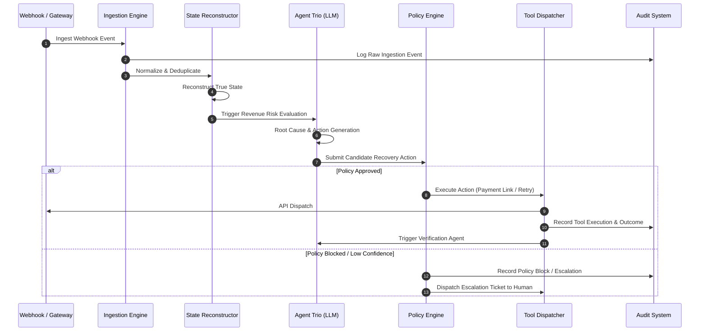

# RAVEN Architecture Specification

## 1. System Purpose

**RAVEN — Revenue-aware Autonomous Verification & ENgine** is an AI-powered revenue intelligence and autonomous recovery system built for payment processing ecosystems (specifically targeted at the Razorpay ecosystem under the AI Revenue Recovery track).

In payment processing systems, transaction failure rates, subscription drops, authorization timeouts, and asynchronous webhooks frequently create "revenue leakage" (unrecovered legitimate revenue) and "revenue at risk" (transactions stalled in intermediate/failed states that could be saved). 

RAVEN ingests financial events, reconstructs true transaction and account states from out-of-order and duplicated webhooks, diagnoses root causes of failure, plans bounded recovery interventions, enforces strict deterministic business policies, executes authorized recovery actions, and verifies true financial recovery with auditable verification loops.

---

## 2. Major Components & Responsibilities

RAVEN consists of four distinct architectural layers:

```
[ External Webhook / Simulator Stream ]
                  │
                  ▼
┌─────────────────────────────────────────────────────────┐
│              DETERMINISTIC INGESTION & STATE            │
│  - Event Ingestion & Deduplication (Idempotency Key)   │
│  - Event Replay & State Reconstruction Engine           │
│  - Revenue Risk Detector (Deterministic Rule Filters)   │
└─────────────────────────┬───────────────────────────────┘
                          │ Event Stream / Risk Trigger
                          ▼
┌─────────────────────────────────────────────────────────┐
│                    AI / AGENT LAYER                     │
│  - Root Cause Analyst (Contextual Diagnosis)            │
│  - Recovery Planner (Candidate Action Generation)       │
│  - Verification Agent (Financial State Validation)      │
└─────────────────────────┬───────────────────────────────┘
                          │ Proposed Recovery Action + Confidence
                          ▼
┌─────────────────────────────────────────────────────────┐
│              DETERMINISTIC POLICY ENGINE                │
│  - Policy Verification (Limits, State Checks, Opt-out)  │
│  - Policy Decision: APPROVE / BLOCK / ESCALATE         │
└─────────────────────────┬───────────────────────────────┘
                          │ Approved Side-Effects Only
                          ▼
┌─────────────────────────────────────────────────────────┐
│           SIDE-EFFECT EXECUTION & AUDIT TRAIL           │
│  - Razorpay Gateway API / Simulator Tool Execution      │
│  - Immutable Audit Event Logging                        │
└─────────────────────────────────────────────────────────┘
```

### Component Summary

1. **Deterministic Ingestion & State Reconstruction Engine (`domain/state`, `events/`)**:
   - Ingests incoming payment events (webhooks, API logs, simulator events).
   - Deduplicates incoming events using cryptographic content hashing and idempotency keys.
   - Computes true entity state (Order, Payment, Customer, Subscription) by deterministic event replay.

2. **Revenue Risk Detector (`domain/revenue/`)**:
   - Identifies payment attempts stuck in intermediate failed/abandoned states where recoverable revenue is identified.

3. **Autonomous Agent Trio (`agents/`)**:
   - **Root Cause Analyst**: Synthesizes customer payment history, issuer error codes, network latency logs, and failure trends to explain *why* revenue is at risk.
   - **Recovery Planner**: Evaluates candidate interventions (e.g., smart retry timing, payment link dispatch, fallback channel notification) and estimates expected recovery value (\(EV = P(\text{success}) \times \text{Value} - \text{InterventionCost}\)).
   - **Verification Agent**: Validates whether executed actions converted target transactions into captured funds.

4. **Deterministic Policy Engine (`policies/`)**:
   - Evaluates candidate actions against non-bypassable merchant rules (e.g., max retries, captured payment guards, high-value transaction limits, customer consent).

5. **Tool Architecture & Side-Effect Dispatcher (`tools/`)**:
   - Encapsulates Razorpay API calls, communication dispatches, and state updates with explicit permissions and idempotency constraints.

6. **Immutable Audit System (`domain/state/audit.py`)**:
   - Logs every event ingestion, state transition, agent reasoning payload, policy evaluation outcome, tool execution, and verification check.

---

## 3. Data & Event Flow



---

## 4. Deterministic vs. AI/ML Boundary

A core principle of RAVEN is strict architectural isolation between deterministic logic and LLM operations.

| Operational Task | Layer | Justification |
| :--- | :--- | :--- |
| Monetary Calculation | **Deterministic** | Floating-point or probabilistic model drift in financial math is intolerable. All balances computed in integer minor units (`paise`). |
| Event Deduplication | **Deterministic** | Must strictly enforce exact-once state updates via hash verification. |
| Payment State Reconstruction | **Deterministic** | State machine transitions (`CREATED` → `AUTHORIZED` → `CAPTURED`) follow immutable state invariants. |
| Signature Verification | **Deterministic** | HMAC-SHA256 signature verification must be exact. |
| Root Cause Synthesis | **AI / ML** | Unstructured error logs, historical issuer behavior, and multi-factor context require pattern matching and reasoning. |
| Candidate Recovery Generation | **AI / ML** | Contextual ranking of retry timing, message personalization, and channel selection benefits from semantic reasoning. |
| Policy Enforcement | **Deterministic** | Hard bounds (max 3 retries, no retries on already-captured funds, spending caps) must **never** be overridable by prompt injection or model hallucination. |
| Side-Effect Execution | **Deterministic** | Tool calls require validated parameters and policy token verification before executing API calls. |
| Audit Logging | **Deterministic** | Append-only, tamper-evident record keeping. |

---

## 5. External Integration vs. Synthetic Simulator Boundary

To ensure development rigor without reliance on live production keys during testing, RAVEN defines a strict abstraction boundary:

- **`simulator/`**: Local deterministic event producer generating complex edge cases (duplicate webhooks, out-of-order delivery, transient gateway timeouts, bank downtimes).
- **`apps/api/webhooks/`**: Production/Test mode webhook receiver that validates HMAC signatures against Razorpay headers (`X-Razorpay-Signature`).
- **`tools/`**: Implements a unified adapter interface (`PaymentGatewayAdapter`). In simulation mode, it routes commands to `SimulatorGatewayAdapter`; in Razorpay mode, it routes commands to `RazorpayGatewayAdapter`.

---

## 6. Frontend / Backend Boundary

- **Backend (`apps/api`)**: Python (FastAPI / Pydantic) delivering REST endpoints for event ingestion, agent execution control, policy configuration, and evaluation reporting.
- **Frontend (`apps/dashboard`)**: Single Page Dashboard (HTML/JS or React/Vite) interacting with backend via REST JSON APIs to visualize transaction state graphs, real-time risk queues, active agent reasoning paths, policy block events, and recovery performance metrics.
