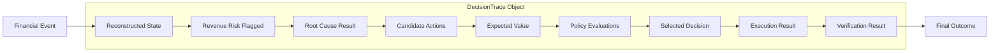

# RAVEN DecisionTrace Specification

## 1. Concept & Purpose

In an autonomous revenue recovery system, auditability and explainability are core architectural requirements. **`DecisionTrace`** is a first-class domain entity in RAVEN that captures the end-to-end lineage of an autonomous recovery decision.

Rather than scattering decision context across disjoint log files or database tables, `DecisionTrace` provides a unified, queryable structure that links the complete operational lifecycle:

$$\text{EVENT} \rightarrow \text{STATE} \rightarrow \text{REVENUE RISK} \rightarrow \text{ROOT CAUSE} \rightarrow \text{CANDIDATE ACTIONS} \rightarrow \text{EXPECTED VALUE} \rightarrow \text{POLICY} \rightarrow \text{DECISION} \rightarrow \text{EXECUTION} \rightarrow \text{VERIFICATION} \rightarrow \text{OUTCOME}$$

---

## 2. Structural Schema

```text
DecisionTrace
├── decision_id                    : String (UUID / trace_01H...)
├── recovery_opportunity_id        : String (opp_...)
├── merchant_id                    : String (mer_...)
├── customer_id                    : String (cust_...)
├── payment_id                     : String (pay_...)
├── input_state_snapshot           : JSON (Reconstructed Payment & Order state)
├── evidence_references            : List[String] (FinancialEvent IDs used as input)
├── root_cause_result              : JSON (Root Cause Analyst output & confidence)
├── candidate_actions              : List[JSON] (Generated intervention options)
├── value_estimates                : List[JSON] (EV calculations per candidate)
├── policy_evaluations             : List[JSON] (Rule-by-rule policy evaluation results)
├── selected_action                : Optional[JSON] (Candidate approved by policy or chosen for escalation)
├── policy_token_id                : Optional[String] (PolicyApprovalToken ID if approved)
├── execution_result               : Optional[JSON] (Tool execution outcome / response)
├── verification_result            : Optional[JSON] (Verification Agent post-action check)
└── timestamps                     : JSON (Created, evaluated, executed, verified UTC timestamps)
```

---

## 3. Decision Lineage Tracing



---

## 4. Invariants & Lifecycle Requirements

1. **Immutability**: Once a step in `DecisionTrace` is populated, it cannot be mutated. Subsequent state changes append to downstream fields (e.g., `execution_result` → `verification_result`).
2. **Complete Traceability**: Given any `decision_id`, an operator or auditor must be able to inspect every raw event ID in `evidence_references` that contributed to the input state snapshot.
3. **Policy Proof**: If `selected_action` is populated and executed, `policy_evaluations` MUST contain an explicit `APPROVED` evaluation entry matching the issued `policy_token_id`.
4. **Failure Traceability**: If an action fails due to policy block, agent failure, tool timeout, or verification failure, `DecisionTrace` records the failure reason and final status (`BLOCKED`, `ESCALATED`, or `FAILED_VERIFICATION`) without corrupting state history.
