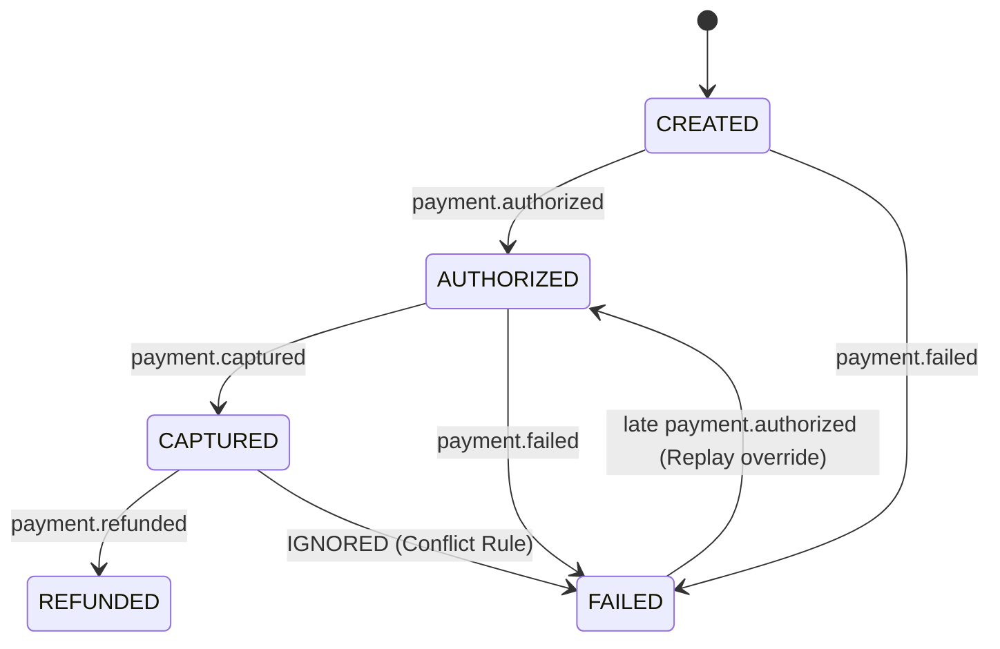

# RAVEN Event Architecture & State Reconstruction Engine

## 1. Overview

Payment webhooks and financial event notifications in real-world networks (e.g., Razorpay, banks, card networks) are inherently **asynchronous**, **unreliable**, **duplicated**, and **out-of-order**.

A naive system that assumes strictly ordered, exactly-once delivery will corrupt entity states—for example, processing an out-of-order `payment.failed` event *after* a `payment.captured` event could accidentally reopen a successfully paid order.

RAVEN implements a deterministic **Event Sourcing and Replay Engine** that processes immutable `FinancialEvent` records to derive true entity state without relying on arrival order.

---

## 2. Ingestion & Normalization Pipeline

```
Incoming Webhook HTTP POST
          │
          ▼
┌─────────────────────────────────────────┐
│ 1. Signature Verification (HMAC-SHA256) │
└────────────────────┬────────────────────┘
                     │ Valid
                     ▼
┌─────────────────────────────────────────┐
│ 2. Deduplication & Idempotency Check    │
└────────────────────┬────────────────────┘
                     │ New Event
                     ▼
┌─────────────────────────────────────────┐
│ 3. Canonical Event Normalization        │
└────────────────────┬────────────────────┘
                     │ Normalized Event
                     ▼
┌─────────────────────────────────────────┐
│ 4. Append to Immutable Event Store      │
└────────────────────┬────────────────────┘
                     │ Event Persisted
                     ▼
┌─────────────────────────────────────────┐
│ 5. Trigger Deterministic State Replay   │
└─────────────────────────────────────────┘
```

### Step 1: Signature Verification
Webhooks from Razorpay or external providers are validated using HMAC-SHA256 cryptographic signatures calculated over the raw request payload:
$$\text{Expected Signature} = \text{HMAC-SHA256}(\text{raw\_body}, \text{webhook\_secret})$$
If signatures fail, the ingestion engine immediately returns HTTP `401 Unauthorized` and logs a security audit event without altering system state.

### Step 2: Deduplication & Idempotency
- **Event Hash**: Every ingested payload is hashed using SHA256 over its normalized body (`event_hash`).
- **Gateway Event ID**: Extracted directly from payload metadata (e.g., `event_id` or `id`).
- **Deduplication Logic**: If an event with matching `event_hash` or `gateway_event_id` already exists in `FinancialEvent` storage, the engine skips reprocessing and returns HTTP `200 OK` (idempotent response).

### Step 3: Canonical Event Normalization
Raw payloads from different sources (Razorpay webhooks, simulator events, manual gateway status checks) are mapped into a standardized RAVEN schema:
```json
{
  "event_id": "evt_01H9Z...",
  "gateway_event_id": "event_M123456789",
  "event_type": "PAYMENT_FAILED",
  "entity_id": "pay_M123456789",
  "order_id": "order_M987654321",
  "merchant_id": "mer_01H...",
  "customer_id": "cust_01H...",
  "amount_paise": 500000,
  "currency": "INR",
  "occurred_at": "2026-08-21T22:00:00Z",
  "received_at": "2026-08-21T22:00:05Z",
  "raw_payload": { ... }
}
```

---

## 3. State Reconstruction & Event Replay Engine

Instead of mutating payment state tables directly upon webhook receipt, RAVEN derives true entity state deterministically:

1. **Query Event Log**: Retrieve all `FinancialEvent` records for a given `payment_id` or `order_id`.
2. **Sort by Event Timestamp**: Order events strictly by `occurred_at` timestamp (falling back to sequence numbers for tie-breaking).
3. **Execute Deterministic State Machine Transition**:



---

## 4. Edge Case Handling Rules

### 4.1 Out-of-Order Webhooks
- **Scenario**: `payment.captured` arrives at `T+1s`, but `payment.authorized` arrives at `T+5s`.
- **Resolution**: Event replay orders events by `occurred_at`. State machine evaluates `payment.authorized` first, then `payment.captured`. Final reconstructed state is `CAPTURED`.

### 4.2 Late Arriving Events & Delayed Authorizations
- **Scenario**: Gateway sends `payment.failed` at `T+0` due to network timeout, but bank actually captured funds at `T+120s` and dispatches `payment.captured` late.
- **Resolution**: `payment.captured` has higher terminal priority than `payment.failed`. The State Reconstructor transitions payment from `FAILED` → `CAPTURED`, closes open `RecoveryOpportunity`, and emits an audit event.

### 4.3 Conflicting Events (Terminal State Protection)
- **Invariant**: Once a payment transitions to a terminal positive state (`CAPTURED`), any subsequent or out-of-order `payment.failed` event for that payment ID is flagged as **INVALID_OUT_OF_ORDER_CONFLICT** and ignored by state computation.

### 4.4 Ambiguous Payment States
- **Scenario**: Gateway reports payment status as `PENDING` or `UNKNOWN` past tolerance window (\(>15\text{ mins}\)).
- **Resolution**: State Engine sets payment status to `AMBIGUOUS`. Policy Engine prohibits automated recovery actions on `AMBIGUOUS` payments until `verify_payment_state` tool runs or human escalation resolves state.

---

## 5. Synthetic Simulator Stream Integration

The simulator engine (`simulator/`) emits synthetic event batches matching Razorpay event structures with configurable noise parameters:
- **Duplicate Rate**: Percentage of events dispatched 2+ times.
- **Reordering Delay**: Random delay (\(0 - 300\text{ seconds}\)) injected into specific webhooks.
- **Drop Rate**: Percentage of webhooks intentionally omitted to test state polling reconciliation.
