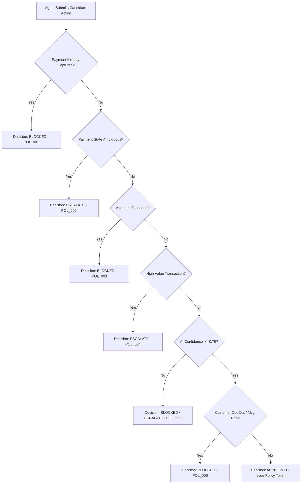

# RAVEN Policy Engine Specification

## 1. Absolute Policy Veto Authority

The **Deterministic Policy Engine** is the non-bypassable governance layer of RAVEN. 

### Fundamental Rule
An AI Agent (Root Cause Analyst, Recovery Planner, or Verification Agent) can **never** execute an action directly or override a policy rule. 

Every candidate action generated by an AI Agent must be submitted to the Policy Engine for evaluation. The Policy Engine evaluates the action against strict deterministic business rules and issues one of three non-negotiable decisions:
1. `APPROVED`: Generates a cryptographic `PolicyApprovalToken` granting permission for tool execution.
2. `BLOCKED`: Rejects the action completely, logs a policy block audit event, and halts execution.
3. `ESCALATE_TO_HUMAN`: Routes the transaction and proposed candidate action to the merchant operations dashboard for manual review.

---

## 2. Core Policy Definitions

### Policy Rule 1: Captured Payment Guard (`POL_001`)
- **Rule**: If `payment.status == CAPTURED` or `order.status == PAID`, **ALL** candidate recovery actions (retries, payment links, messaging) MUST BE BLOCKED immediately.
- **Decision**: `BLOCKED`
- **Rationale**: Prevents catastrophic double-charging of customers.

### Policy Rule 2: Ambiguous State Isolation (`POL_002`)
- **Rule**: If `payment.status == AMBIGUOUS` or `payment.status == PENDING`, automated retry or communication actions are prohibited until state verification resolves status to `FAILED` or `CAPTURED`.
- **Decision**: `ESCALATE_TO_HUMAN` (or `BLOCKED` for automated retry tools).
- **Rationale**: Retrying a payment that is secretly in-flight on the card network risks duplicate charges.

### Policy Rule 3: Maximum Recovery Attempt Cap (`POL_003`)
- **Rule**: A single `OpportunityID` or `PaymentID` may not exceed `max_recovery_attempts` (default: 3 attempts per 72 hours, or merchant-defined limit).
- **Decision**: `BLOCKED` if `attempts_count >= max_attempts`.
- **Rationale**: Protects against spamming payment networks and harassing customers.

### Policy Rule 4: High-Value Transaction Boundary (`POL_004`)
- **Rule**: If transaction `amount_paise > high_value_threshold_paise` (default: ₹10,000 / `1000000` paise), autonomous execution is disabled.
- **Decision**: `ESCALATE_TO_HUMAN`
- **Rationale**: High-value transactions carry elevated commercial risk and require merchant human oversight.

### Policy Rule 5: Low Confidence Threshold (`POL_005`)
- **Rule**: If candidate action `agent_confidence < min_confidence_threshold` (default: `0.75`), autonomous tool dispatch is blocked.
- **Decision**: `ESCALATE_TO_HUMAN` if value is high, else `BLOCKED`.
- **Rationale**: Prevents low-confidence AI predictions from triggering unwanted external side-effects.

### Policy Rule 6: Customer Opt-Out & Communication Cap (`POL_006`)
- **Rule**: If `customer.communication_preferences.opt_out == True` or `messages_sent_today >= 2`, external messaging tools (`send_recovery_message`) MUST BE BLOCKED.
- **Decision**: `BLOCKED`
- **Rationale**: Compliance with anti-spam laws, TRAI DND rules, and user privacy settings.

### Policy Rule 7: Systemic Bank Downtime Pause (`POL_007`)
- **Rule**: If `get_failure_patterns` reports `issuer_bank` failure rate exceeding `40%` over the last 15 minutes, automated retries targeting that bank are paused.
- **Decision**: `BLOCKED` (with retry scheduled for post-downtime window).
- **Rationale**: Retrying during known bank downtimes guarantees failure and wastes retry caps.

---

## 3. Decision Matrix

---

## 4. Policy Token Security

When the Policy Engine issues an `APPROVED` decision, it generates an ephemeral, cryptographically signed token (`PolicyApprovalToken`):
$$\text{Token} = \text{HMAC-SHA256}(\text{action\_id} \parallel \text{opportunity\_id} \parallel \text{timestamp}, \text{POLICY\_SECRET})$$

Side-effect tools (`create_payment_link`, `retry_payment`, `send_recovery_message`) **require** a valid `PolicyApprovalToken` as an input parameter. If a tool is called without a valid token, execution fails instantly at the boundary.
